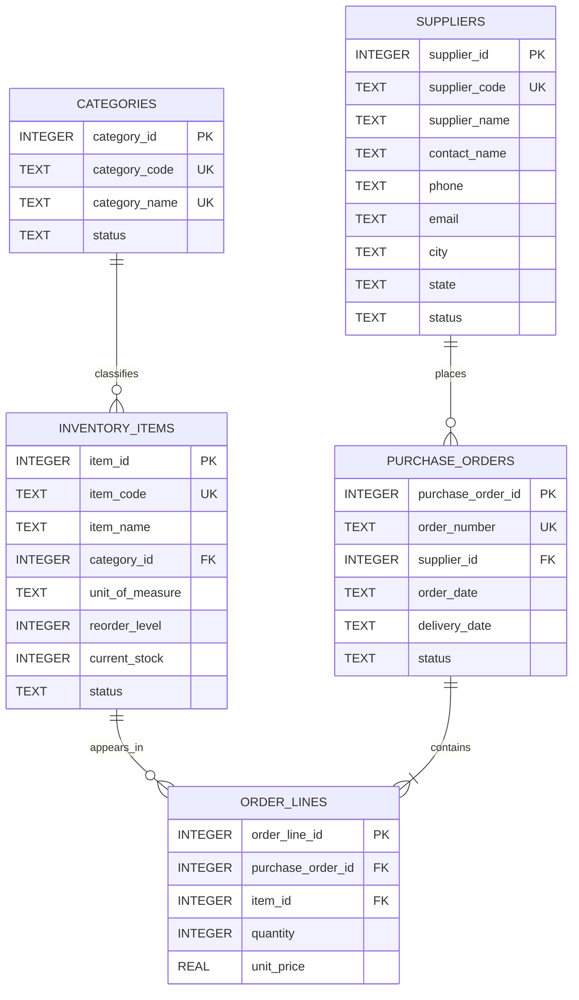

# Vocational Portfolio — Data Management & Processing | 11th International Abilympics Candidate Showcase

## Abhimanyu H K

**Lead Systems & Data Architect | 9+ Years Industry Experience**

**Vocational Trade:** ICT — Data Management and Processing  
**Competition:** 11th International Abilympics  
**Repository:** `abilympics-data-processing-portfolio`  
**Database:** SQLite 3  
**Implementation:** Python 3 Standard Library + ANSI/SQLite SQL  
**Execution Model:** Offline / Single Workstation

---

## 1. Executive Alignment

This repository demonstrates an end-to-end data management and processing workflow designed around the competencies expected in the **ICT — Data Management and Processing** vocational trade.

The implementation deliberately uses an **offline-first, single-workstation architecture**. It does not require a cloud database, external database server, internet connection, or third-party Python package.

The portfolio maps professional engineering discipline into an evaluator-friendly workflow:

```text
Messy Raw CSV
    |
    v
Data Profiling & Cleansing
    |
    v
0NF -> 1NF -> 2NF -> 3NF
    |
    v
Relational SQLite Schema
    |
    v
PK / FK / UNIQUE / CHECK / NOT NULL
    |
    v
Controlled Python ETL
    |
    v
Advanced SQL Processing
    |
    +--> Multi-table joins
    +--> CTEs
    +--> Conditional aggregation
    +--> Subqueries
    +--> COALESCE
    |
    v
Window Analytics
    |
    +--> DENSE_RANK
    +--> ROW_NUMBER
    +--> LAG
    +--> Running SUM
    +--> NTILE
    |
    v
Executive Management Reporting
    |
    v
Automated Verification
```

> **Scope note:** This is a self-developed practice/portfolio repository. It is not an official Abilympics task, official competition solution, or endorsement by NAAI or any other competition organization.

---

## 2. Candidate Profile

**Abhimanyu H K**  
**Lead Systems & Data Architect**  
**9+ Years Industry Experience**

The portfolio applies production-oriented engineering practices to a deliberately controlled vocational assessment environment.

The emphasis is on:

- relational modelling;
- normalization;
- data quality;
- referential integrity;
- deterministic ETL;
- advanced SQL;
- analytical window functions;
- management reporting;
- reproducible offline execution.

The objective is to make the engineering decisions directly inspectable by a technical evaluator.

---

## 3. Competency Matrix

| Competition Competency | Repository Evidence |
|---|---|
| Raw data analysis | `01-schema-normalization-3nf/raw_procurement_data.csv` |
| 0NF analysis | `01-schema-normalization-3nf/normalization_walkthrough.md` |
| First Normal Form | `normalization_walkthrough.md` |
| Second Normal Form | `normalization_walkthrough.md` |
| Third Normal Form | `normalization_walkthrough.md` |
| Relational schema design | `01_ddl_tables_constraints.sql` |
| Primary keys | DDL constraints |
| Foreign keys | DDL constraints |
| NOT NULL constraints | DDL constraints |
| UNIQUE constraints | DDL constraints |
| CHECK constraints | DDL constraints |
| Delete behaviour | `ON DELETE RESTRICT` / `ON DELETE CASCADE` |
| Foreign-key indexing | DDL indexes |
| Data cleansing | `03-data-cleansing-and-etl/ingest_and_cleanse.py` |
| Standard-library ETL | Python `sqlite3`, `csv`, `re`, `datetime`, `sys`, `pathlib` |
| Multi-table joins | `02_complex_analytical_queries.sql` |
| CTE processing | `02_complex_analytical_queries.sql` |
| Conditional aggregation | `02_complex_analytical_queries.sql` |
| Subquery analysis | `02_complex_analytical_queries.sql` |
| Window functions | `03_window_and_aggregations.sql` |
| Executive reporting | `executive_summary_report.sql` |
| End-to-end validation | `verify_solution.py` |

---

## 4. Technology Constraints

### Database

**SQLite 3** is the canonical execution target.

The schema explicitly enables referential integrity:

```sql
PRAGMA foreign_keys = ON;
```

Surrogate keys use:

```sql
INTEGER PRIMARY KEY AUTOINCREMENT
```

The implementation avoids PostgreSQL-specific constructs such as:

- `SERIAL`;
- proprietary data types;
- PostgreSQL-only regular-expression operators;
- server-side procedural extensions;
- external database services.

### Python

The ingestion and validation implementation uses only Python standard-library modules:

```text
sqlite3
csv
re
datetime
sys
pathlib
```

No pandas, SQLAlchemy, NumPy, or other third-party dependency is required.

---

## 5. Repository Structure

```text
abilympics-data-processing-portfolio/
|
+-- README.md
+-- verify_solution.py
|
+-- 01-schema-normalization-3nf/
|   +-- raw_procurement_data.csv
|   +-- normalization_walkthrough.md
|   +-- 01_ddl_tables_constraints.sql
|
+-- 02-advanced-sql-processing/
|   +-- 02_complex_analytical_queries.sql
|   +-- 03_window_and_aggregations.sql
|
+-- 03-data-cleansing-and-etl/
|   +-- ingest_and_cleanse.py
|
+-- 04-reporting-and-business-intelligence/
|   +-- executive_summary_report.sql
|
+-- procurement.db
    generated locally by the verification workflow
```

The SQLite database is an execution artifact and does not need to be supplied as a pre-built database.

---

## 6. Visual Architecture — Normalized Relational Model

The final model contains exactly five core normalized entities:

1. `suppliers`
2. `categories`
3. `inventory_items`
4. `purchase_orders`
5. `order_lines`

### Mermaid ER Diagram



### Relationship Interpretation

- One supplier can place many purchase orders.
- One category can classify many inventory items.
- One purchase order contains one or more order lines.
- One inventory item can occur on many order lines.

The design separates master data from transaction data and prevents repeated supplier/category/item attributes from being stored on every transaction line.

---

## 7. Normalization Strategy

The source spreadsheet intentionally represents a realistic denormalized operational extract.

The transformation follows:

```text
0NF
 |
 | remove repeating groups / make values atomic
 v
1NF
 |
 | remove partial dependencies
 v
2NF
 |
 | remove transitive dependencies
 v
3NF
```

Examples of dependencies removed during normalization include:

```text
supplier_id -> supplier_name, phone, email, city, state
category_id -> category_name
item_id -> item_name, category_id, unit_of_measure
purchase_order_id -> supplier_id, order_date, delivery_date, status
(order_id, item_id) -> quantity, unit_price
```

Supplier contact information therefore belongs to `suppliers), not repeatedly to individual purchase-order lines.

The complete academic/vocational explanation is contained in:

```text
01-schema-normalization-3nf/normalization_walkthrough.md
```

---

## 8. Database Integrity Model

The schema uses database-level constraints wherever the rule belongs to the relational layer.

### Primary Keys

Every entity has an explicit primary key:

```text
supplier_id
category_id
item_id
purchase_order_id
order_line_id
```

### Foreign Keys

Examples:

```text
purchase_orders.supplier_id
        |
        +--> suppliers.supplier_id

order_lines.purchase_order_id
        |
        +--> purchase_orders.purchase_order_id

order_lines.item_id
        |
        +--> inventory_items.item_id
```

### Domain Rules

The DDL enforces business-valid values such as:

```text
unit_price >= 0
quantity > 0
status IN (PENDING, APPROVED, RECEIVED, CANCELLED)
delivery_date >= order_date
```

### Delete Behaviour

The schema explicitly distinguishes parent/master protection from dependent transaction cleanup:

- supplier/category/item master records use restricted deletion where appropriate;
- purchase-order deletion can cascade to its dependent order lines.

---

## 9. Data Cleansing and ETL

The ingestion script implements a deterministic pipeline:

```text
raw_procurement_data.csv
          |
          v
      CSV Reader
          |
          v
   Field Validation
          |
          v
  Normalization Rules
     /       |       \
   dates   phones   emails
     \       |       /
          v
    Business Validation
          |
      +---+---+
      |       |
      v       v
   accepted rejected
      |       |
      v       v
   SQLite   summary
```

The cleansing process includes:

- trimming whitespace;
- standardizing case;
- normalizing phone numbers;
- standardizing email addresses;
- parsing multiple source date formats;
- converting dates to ISO `YYYY-MM-DD`;
- validating numeric quantities;
- validating unit prices;
- rejecting malformed rows;
- inserting parent records before dependent records;
- reporting ingestion statistics.

Invalid source data is not silently converted into trusted data.

---

## 10. Advanced SQL Processing

The analytical SQL layer contains five independent business queries.

### 1. Multi-Table Spend Analysis

Demonstrates a four-table relationship across:

```text
suppliers
purchase_orders
order_lines
inventory_items
```

and uses `COALESCE` for incomplete/cancelled transaction values.

### 2. Supplier Fulfillment Performance

Uses multi-level CTEs to calculate:

- order lead time;
- delivery status;
- supplier-level fulfillment metrics;
- on-time completion rate.

### 3. Conditional Category Metrics

Uses conditional aggregation such as:

```sql
COUNT(CASE WHEN ... THEN 1 END)
SUM(CASE WHEN ... THEN ... END)
```

to compare procurement states.

### 4. Inventory Depletion & Restock Alert

Combines current inventory levels with pending purchase-order quantities to identify replenishment conditions.

### 5. Cost Variance Against Category Benchmark

Compares individual purchase-line costs against the historical category average using a subquery.

Every analytical statement includes its expected result as a commented Markdown table.

---

## 11. Window Function Analytics

The portfolio includes four practical window-function exercises.

### Top-N Spend Items per Category

Uses:

```sql
DENSE_RANK()
ROW_NUMBER()
```

partitioned by category.

### Sequential Purchase Cost Variance

Uses:

```sql
LAG()
```

to compare each purchase order with its preceding order.

### Cumulative Supplier Spend

Uses:

```sql
SUM(...) OVER (
    PARTITION BY supplier_id
    ORDER BY order_date
)
```

to produce a running supplier expenditure metric.

### Fulfillment Quartiles

Uses:

```sql
NTILE(4)
```

to partition delivery turnaround times into four analytical groups.

Every window query also includes a commented Markdown expected-output table.

---

## 12. Executive Management Reporting

The reporting layer transforms transactional data into a supplier-level management view.

The report contains:

| Metric | Meaning |
|---|---|
| Supplier Name | Supplier business identity |
| Supplier Code | Unique supplier identifier |
| Total Orders Placed | Number of purchase orders |
| Total Orders Received | Number of received purchase orders |
| Total Capital Outlay | Procurement expenditure |
| Average Delivery Cycle | Average order-to-delivery duration |
| On-Time Completion Rate | Percentage of completed orders meeting the delivery criterion |

The report is intentionally management-oriented rather than exposing raw transaction rows.

---

## 13. Proof-of-Output Design

The repository makes SQL results auditable.

Every analytical/window SQL statement is structured as:

```text
SQL statement
     |
     v
Expected-output Markdown table
     |
     v
Automated execution by verify_solution.py
```

This lets an evaluator compare:

1. the SQL logic;
2. the documented expected records;
3. the actual SQLite execution.

Expected-output tables are comments and therefore do not interfere with SQL execution.

---

## 14. Automated Verification

The root orchestrator is:

```text
verify_solution.py
```

Run:

```bash
python verify_solution.py
```

The verification workflow:

1. removes/reinitializes the local database as required;
2. executes the DDL;
3. confirms foreign-key enforcement;
4. executes the cleansing/ingestion pipeline;
5. verifies normalized table population;
6. validates referential integrity;
7. executes all analytical SQL statements;
8. executes all window-function statements;
9. executes the executive report;
10. prints an ASCII pass/fail summary.

The evaluator therefore has a single canonical entry point.

---

## 15. Quickstart

### Prerequisites

- Python 3
- SQLite support through Python's `sqlite3` module
- No third-party Python packages
- No internet connection required

### Run

From the repository root:

```bash
python verify_solution.py
```

The command is the primary verification mechanism.

---

## 16. Expected Verification Flow

A successful execution should report checks along the following lines:

```text
============================================================
 ABILYMPCS DATA MANAGEMENT & PROCESSING VERIFICATION
============================================================

[PASS] SQLite database initialized
[PASS] Foreign-key enforcement enabled
[PASS] DDL executed successfully
[PASS] Raw CSV processed
[PASS] Suppliers loaded
[PASS] Categories loaded
[PASS] Inventory items loaded
[PASS] Purchase orders loaded
[PASS] Order lines loaded
[PASS] Referential integrity validated
[PASS] Analytical SQL executed
[PASS] Window SQL executed
[PASS] Executive report executed

============================================================
 FINAL RESULT: ALL TESTS PASSED
============================================================
```

The final implementation will calculate actual record counts from the supplied dataset rather than relying on undocumented hard-coded database state.

---

## 17. Evaluator Walkthrough

A technical evaluator can review the portfolio in this order:

### Step 1 — Inspect source quality

```text
01-schema-normalization-3nf/raw_procurement_data.csv
```

Look for deliberate anomalies such as:

- inconsistent dates;
- inconsistent phone formats;
- whitespace;
- casing mismatches;
- duplicated supplier information;
- combined location fields.

### Step 2 — Review normalization reasoning

```text
01-schema-normalization-3nf/normalization_walkthrough.md
```

Trace:

```text
0NF -> 1NF -> 2NF -> 3NF
```

### Step 3 — Inspect DDL

```text
01-schema-normalization-3nf/01_ddl_tables_constraints.sql
```

Verify:

- PKs;
- FKs;
- NOT NULL;
- UNIQUE;
- CHECK;
- delete behaviour;
- indexes.

### Step 4 — Inspect ETL

```text
03-data-cleansing-and-etl/ingest_and_cleanse.py
```

Verify how dirty source data is transformed into normalized records.

### Step 5 — Inspect advanced SQL

```text
02-advanced-sql-processing/02_complex_analytical_queries.sql
```

Review joins, CTEs, conditional aggregation, COALESCE and subqueries.

### Step 6 — Inspect window analytics

```text
02-advanced-sql-processing/03_window_and_aggregations.sql
```

Review ranking, sequencing, cumulative metrics and quartiles.

### Step 7 — Inspect management reporting

```text
04-reporting-and-business-intelligence/executive_summary_report.sql
```

Review supplier-level business reporting.

### Step 8 — Execute the complete workflow

```bash
python verify_solution.py
```

---

## 18. Design Principles

### Correctness

Database constraints enforce fundamental relational rules at the database boundary.

### Determinism

The same source data and schema should produce reproducible results from a clean database.

### Separation of Concerns

```text
Raw Data
   |
Cleansing
   |
Normalization
   |
DDL
   |
ETL
   |
Analytical SQL
   |
Window Analytics
   |
Executive Reporting
   |
Verification
```

### Explainability

Each major transformation is documented so that an evaluator can follow:

```text
Raw field
   |
Cleansing rule
   |
Normalized entity
   |
Constraint
   |
Analytical query
   |
Business metric
```

### Offline Execution

The core workflow requires no:

- cloud database;
- external API;
- internet service;
- Docker environment;
- PostgreSQL server;
- MySQL server;
- pandas;
- SQLAlchemy.

---

## 19. Final Portfolio Outcome

This repository demonstrates the complete transformation:

```text
MESSY OPERATIONAL DATA
          |
          v
DATA QUALITY ANALYSIS
          |
          v
DATA CLEANSING
          |
          v
3NF RELATIONAL DESIGN
          |
          v
CONSTRAINT-DRIVEN SQLITE DATABASE
          |
          v
ADVANCED SQL PROCESSING
          |
          v
WINDOW ANALYTICS
          |
          v
EXECUTIVE REPORTING
          |
          v
AUTOMATED VERIFICATION
```

The resulting portfolio provides inspectable evidence of relational modelling, database integrity, SQL processing, data cleansing, analytical reasoning and management reporting within an offline workstation environment.

---

## 20. Author

**Abhimanyu H K**  
Lead Systems & Data Architect  
9+ Years Industry Experience

GitHub: https://github.com/AbhimanyuHK
